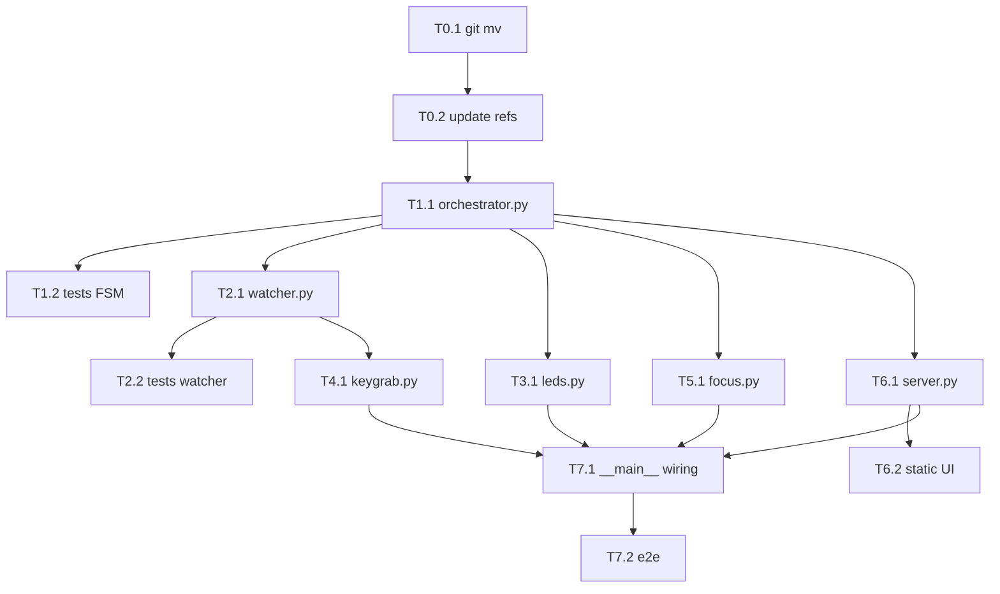

# 📋 Implementation Plan: Codex Pad (daemon macOS + webapp)

**Version**: 1.1
**Generated**: 2026-07-18 17:56
**Last Updated**: 2026-07-18 18:00
**Filename**: `260718_1756_codex_chat_orchestrator_plan.md`
**Location**: `/docs/plans/`
**Planner**: @planner
**Status**: ✅ Complete

---

## 📊 Plan Overview

| Field | Value |
|-------|-------|
| **Objective** | Daemon macOS che monitora chat Codex (via `~/.codex` jsonl), le associa FIFO ai 3 tasti del tastierino (LED: breath ciano = genera, verde = finito, rosso = abortito), tasto premuto = focus app; webapp di monitoraggio su porta 8766. Rename `app/` → `configurator/` senza cancellarla. |
| **Complexity** | High |
| **Total Phases** | 8 |
| **Total Tasks** | 13 |
| **Estimated Duration** | 3-4 giorni |
| **Risk Level** | Medium |
| **Executor Profile** | Low-capability model — plan is fully deterministic, zero decisions left |

---

## 🧭 Decision Ledger

| ID | Decision | Chosen | Rejected Alternatives | Rationale |
|----|----------|--------|----------------------|-----------|
| D1 | Linguaggio daemon+webapp | Python 3 stdlib HTTP | Flask/FastAPI, Swift | Stack identico a `configurator/` esistente; zero framework |
| D2 | Dipendenze nuove | `watchdog`, `pyobjc-framework-Quartz` (`hidapi` già in uso) | polling 1s, Hammerspoon | FSEvents nativo via watchdog; CGEventTap unico modo pulito di sopprimere F13-15 |
| D3 | Rename `app/` | `configurator/` (git mv) | `pad_configurator/`, `webapp/` | Nome descrive funzione: configurazione keymap/lighting del pad |
| D4 | Nuovo package | `codex_pad/` | `orchestrator/`, `codexpad/` | Esplicito; run: `python3 -m codex_pad` |
| D5 | Porta webapp | `127.0.0.1:8766` | 8765 | 8765 già occupata da configurator |
| D6 | LED driver | Riusa `configurator.device.MacroPad` (`set_rgb_led`, `set_continuous_pulse_led`) | duplicare protocollo | Single source: `firmware/include/protocol.h` già letto da `configurator.protocol` |
| D7 | Monitor eventi | watchdog su `~/.codex` + polling 1s delle sessioni recenti, tail incrementale per file con dict offset | app-server JSON-RPC proprio, ipc.sock | FSEvents macOS consegna eventi con path vuoto o li perde; polling leggero garantisce `task_complete` |
| D8 | Identità chat | UUID da filename `rollout-*-<uuid>.jsonl`; nome da `session_index.jsonl` | pid, titolo finestra | Stabile su resume; provato: index contiene `{id, thread_name}` |
| D9 | Keygrab | CGEventTap (Quartz) su keycode mac 105/107/113 (F13/F14/F15), swallow sempre | Karabiner, IOKit HID | F15 è 113 (111 è F12); keymap L0 ripristinata a 0x68/0x69/0x6A e salvata EEPROM |
| D10 | Long-press | ≥800 ms keydown→keyup | doppio click | Firmware non distingue; misura lato daemon su eventi tap |
| D11 | Focus chat | `open codex://threads/<thread-id>`; fallback `open -a ChatGPT`, poi `open -a Codex` | AppleScript AX | Deep-link ufficiale verificato: apre chat locale esatta usando session UUID/thread ID |
| D12 | Persistenza binding | `codex_pad/data/bindings.json`, write atomico tmp+replace | sqlite | 3 slot; json basta |
| D13 | Stati LED | FREE=spento, GENERATING=breath ciano (0,200,220) 1500ms div 8, DONE=verde (0,200,0), ABORTED=rosso (200,0,0) | giallo approval | Approval non presente nei jsonl (verificato in brainstorm) |
| D14 | Release | press su DONE → focus + release dopo 5s; ABORTED → release auto dopo 5s; long-press → unbind immediato | release su doppia pressione | Deciso in brainstorm (FIFO A + ack) |
| D15 | Eviction | Solo slot DONE, il più vecchio per `done_at`; mai evict GENERATING; overflow → lista `unbound` (max 10) | eviction LRU globale | Deciso in brainstorm |
| D16 | Rebuild avvio | Scan file rollout modificati nelle ultime 2h, replay eventi ordinati per mtime, poi load bindings.json e applica eventi più recenti | nessun rebuild | Daemon restart non deve perdere stato |
| D17 | Notifica bind | `osascript -e 'display notification ...'` | nessuna notifica | Pad senza display: legenda tasto↔chat via notifica macOS |
| D18 | Clock FSM | `ts` esplicito passato a ogni metodo Orchestrator | `time.monotonic()` interno | Testabilità con fake clock |

---

## 📖 Executor Instructions (for @developer)

1. Execute tasks strictly in order. Do not reorder, merge, or skip.
2. Type code EXACTLY as specified in Code Specification blocks. Do not rename, reformat logic, or "improve".
3. Where the plan says "insert after line containing `<exact text>`", locate by exact text match.
4. Run every Verification command; compare output literally against Expected.
5. If any step or verification fails: follow the task's **On Failure** instruction. Default: STOP, report exact error output, wait.
6. Never touch files not listed in the task's **Files** field. Never install packages not listed in the plan.
7. Mark checkboxes and update Status after each task (per @developer protocol).

---

## 📈 Progress Tracker

**Overall Completion**: 13/13 tasks — 100%

| Phase | Tasks Complete | Status |
|-------|---------------|--------|
| Phase 0: Rename app→configurator | 2/2 | ✅ (adattato: `app/configurator`) |
| Phase 1: Core FSM + tests | 2/2 | ✅ |
| Phase 2: Session watcher | 2/2 | ✅ |
| Phase 3: LED driver | 1/1 | ✅ |
| Phase 4: Keygrab F13-15 | 1/1 | ✅ (verifica manuale in T7.2) |
| Phase 5: Focus + notify | 1/1 | ✅ |
| Phase 6: Webapp server + UI | 2/2 | ✅ |
| Phase 7: Integration + e2e | 2/2 | ✅ |

**Last Update**: 2026-07-18 by @developer — complete: 26 test verdi, LED FSM, polling rollout, keygrab short/long, exact-chat deep-link verificati

---

## 🎯 Success Criteria

- [x] `python3 -m pytest tests -q` exits 0 (26 passed)
- [x] `python3 -c "from app.configurator import server"` prints no error
- [x] `python3 -m app.codex_pad --no-keygrab` parte su `http://127.0.0.1:8766`
- [x] `curl -s http://127.0.0.1:8766/api/status` ritorna JSON con `slots`, `unbound`, `device`
- [x] E2E manuale: task → breath ciano → verde; short press → chat esatta + release 5s; long press → unbind immediato

---

## 📐 Phase Breakdown

### - [x] Phase 0: Rename app → configurator

**Priority**: P0
**Goal**: Rinominare package esistente senza perdere nulla, aggiornare tutti i riferimenti
**Dependencies**: None
**Estimated Effort**: S
**Deliverables**: `configurator/` funzionante, test esistenti verdi
**Status**: ⏳ Pending

---

#### - [x] Task 0.1: git mv app configurator + pulizia pycache

**ID**: T0.1
**Owner**: @developer
**Priority**: P0
**Effort**: XS (< 1h)
**Blocked By**: None
**Blocks**: T0.2, T6.1
**Status**: ⏳ Pending

**Files**:
- RENAME: `app/` → `configurator/`
- DO NOT TOUCH: `firmware/`, `tests/`, `docs/`

**Implementation Steps** (strictly in order):
1. Run: `git mv app configurator`
2. Run: `rm -rf configurator/__pycache__`
3. Run: `git status` — expected: `renamed: app/... -> configurator/...` per ogni file.

**Commands**:
```bash
git mv app configurator
rm -rf configurator/__pycache__
git status
```

**Verification**:
```bash
ls configurator
# expected: __init__.py  data  device.py  firmware.py  protocol.py  server.py  settings_store.py  static
test -d app && echo "FAIL app still exists" || echo "ok"
# expected: ok
```

**On Failure**: If `git mv` fails → STOP and report exact error. Do NOT use plain `mv` without reporting.

**Forbidden**:
- Do not edit any file content in this task
- Do not touch `app/data/settings.json` content (moves with the directory)

**Acceptance Criteria**:
- [ ] Directory `configurator/` exists with all 8 entries listed above
- [ ] Directory `app/` does not exist
- [ ] `git status` shows renames

**Completion Log**:
- Started: — by —
- Completed: — by —
- Notes: —

---

#### - [x] Task 0.2: Update imports and docs references

**ID**: T0.2
**Owner**: @developer
**Priority**: P0
**Effort**: XS
**Blocked By**: T0.1
**Blocks**: T1.1
**Status**: ⏳ Pending

**Files**:
- MODIFY: `tests/test_device.py`
- MODIFY: `tests/test_firmware.py`
- MODIFY: `docs/06-webapp-python.md`
- MODIFY: `docs/09-codice-e-snapshot.md`
- DO NOT TOUCH: `work/` (copia morta, non toccare)

**Implementation Steps** (strictly in order):
1. In `tests/test_device.py`: replace line `from app.device import MacroPad` with `from configurator.device import MacroPad`; replace line `from app import protocol` with `from configurator import protocol`.
2. In `tests/test_firmware.py`: replace line `from app import firmware` with `from configurator import firmware`.
3. In `docs/06-webapp-python.md`: replace every occurrence of `app/server.py` with `configurator/server.py`, `app/device.py` with `configurator/device.py`, `app/protocol.py` with `configurator/protocol.py`, `app/settings_store.py` with `configurator/settings_store.py`, `app/static` with `configurator/static`, `python -m app` with `python -m configurator`.
4. In `docs/09-codice-e-snapshot.md`: replace line `app/                 Python server, HID and web interface` with `configurator/        Python server, HID and web interface (device configurator)`.
5. Run pytest.

**Commands**:
```bash
python3 -m pytest tests -q
```

**Verification**:
```bash
python3 -m pytest tests -q        # expected: exit 0, all tests passed
python3 -c "from configurator import server, device, protocol, firmware, settings_store; print('import ok')"
# expected output: import ok
grep -rn "from app" tests/        # expected: no output
```

**On Failure**: If pytest fails with `ModuleNotFoundError: No module named 'app'` → a reference was missed; run `grep -rn "from app\|import app" tests/ configurator/` to locate it, fix that exact line, retry once. Any other failure → STOP and report.

**Forbidden**:
- Do not modify test logic or assertions
- Do not touch `work/graphify-code-v1/**` (dead copy)

**Acceptance Criteria**:
- [ ] pytest exits 0
- [ ] Import check prints `import ok`
- [ ] No `from app` references remain in `tests/`

**Completion Log**:
- Started: — by —
- Completed: — by —
- Notes: —

---

### - [x] Phase 1: Core FSM + FIFO binding

**Priority**: P0
**Goal**: Logica pura Orchestrator (slot FSM + FIFO + eviction), 100% unit-testata, zero IO
**Dependencies**: Phase 0
**Estimated Effort**: M
**Deliverables**: `codex_pad/orchestrator.py`, `tests/test_orchestrator.py` (10 test verdi)
**Status**: ⏳ Pending

---

#### - [x] Task 1.1: Create codex_pad/orchestrator.py

**ID**: T1.1
**Owner**: @developer
**Priority**: P0
**Effort**: S (1-4h)
**Blocked By**: T0.2
**Blocks**: T1.2, T7.1
**Status**: ⏳ Pending

**Files**:
- CREATE: `codex_pad/__init__.py` (empty file)
- CREATE: `codex_pad/orchestrator.py`
- DO NOT TOUCH: everything else

**Implementation Steps** (strictly in order):
1. Create directory: `mkdir -p codex_pad`
2. Create empty file `codex_pad/__init__.py` (zero bytes).
3. Create `codex_pad/orchestrator.py` with exact content below.

**Code Specification**:
```python
# codex_pad/orchestrator.py
"""Codex chat <-> slot binding: per-slot FSM + FIFO assign + DONE-only eviction.

Pure logic, no IO. Every method takes explicit ts (injectable clock).
Effects emitted through sink:
  sink.led_off(i) / sink.led_breath_cyan(i) / sink.led_solid(i, (r,g,b))
  sink.focus(name, session_id) / sink.notify(message)
"""
import json
from pathlib import Path

FREE = "free"
GENERATING = "generating"
DONE = "done"
ABORTED = "aborted"

GREEN = (0, 200, 0)
RED = (200, 0, 0)

ACK_RELEASE_S = 5.0
ABORT_RELEASE_S = 5.0
MAX_UNBOUND = 10

STATE_FILE = Path(__file__).resolve().parent / "data" / "bindings.json"


class Slot:
    __slots__ = ("state", "session_id", "name", "bound_at", "done_at", "release_at")

    def __init__(self):
        self.state = FREE
        self.session_id = None
        self.name = ""
        self.bound_at = 0.0
        self.done_at = 0.0
        self.release_at = None

    def to_dict(self):
        return {
            "state": self.state,
            "session_id": self.session_id,
            "name": self.name,
            "bound_at": self.bound_at,
            "done_at": self.done_at,
        }

    @classmethod
    def from_dict(cls, d):
        s = cls()
        s.state = d["state"] if d["state"] in (GENERATING, DONE) else FREE
        s.session_id = d["session_id"]
        s.name = d["name"]
        s.bound_at = d["bound_at"]
        s.done_at = d["done_at"]
        return s


class Orchestrator:
    def __init__(self, sink, slot_count=3):
        self.sink = sink
        self.slots = [Slot() for _ in range(slot_count)]
        self.unbound = []

    # --- helpers ---------------------------------------------------------
    def _slot_of(self, session_id):
        for i, s in enumerate(self.slots):
            if s.session_id == session_id:
                return i
        return None

    def _drop_unbound(self, session_id):
        self.unbound = [u for u in self.unbound if u["session_id"] != session_id]

    def _bind(self, i, session_id, name, ts):
        s = self.slots[i]
        s.state = GENERATING
        s.session_id = session_id
        s.name = name
        s.bound_at = ts
        s.release_at = None
        self.sink.led_breath_cyan(i)
        self.sink.notify("Tasto " + str(i + 1) + " -> " + name)
        self._drop_unbound(session_id)

    def _free(self, i):
        s = self.slots[i]
        s.state = FREE
        s.session_id = None
        s.name = ""
        s.release_at = None
        self.sink.led_off(i)

    # --- session events --------------------------------------------------
    def on_task_started(self, session_id, name, ts):
        i = self._slot_of(session_id)
        if i is not None:
            s = self.slots[i]
            s.state = GENERATING
            s.name = name or s.name
            s.release_at = None
            self.sink.led_breath_cyan(i)
            return
        free = [i for i, s in enumerate(self.slots) if s.state == FREE]
        if free:
            self._bind(free[0], session_id, name, ts)
            return
        done = [i for i, s in enumerate(self.slots) if s.state == DONE]
        if done:
            victim = min(done, key=lambda i: self.slots[i].done_at)
            self._free(victim)
            self._bind(victim, session_id, name, ts)
            return
        if not any(u["session_id"] == session_id for u in self.unbound):
            self.unbound.append(
                {"session_id": session_id, "name": name, "since": ts})
            self.unbound = self.unbound[-MAX_UNBOUND:]

    def on_task_complete(self, session_id, ts):
        i = self._slot_of(session_id)
        if i is None:
            return
        s = self.slots[i]
        s.state = DONE
        s.done_at = ts
        s.release_at = None
        self.sink.led_solid(i, GREEN)

    def on_turn_aborted(self, session_id, ts):
        i = self._slot_of(session_id)
        if i is None:
            return
        s = self.slots[i]
        s.state = ABORTED
        s.release_at = ts + ABORT_RELEASE_S
        self.sink.led_solid(i, RED)

    # --- key events ------------------------------------------------------
    def on_short_press(self, i, ts):
        s = self.slots[i]
        if s.state in (GENERATING, DONE):
            self.sink.focus(s.name, s.session_id)
        if s.state == DONE:
            s.release_at = ts + ACK_RELEASE_S

    def on_long_press(self, i, ts):
        if self.slots[i].state != FREE:
            self._free(i)

    # --- clock -----------------------------------------------------------
    def tick(self, ts):
        """Free slots whose release_at expired. Returns number freed."""
        freed = 0
        for i, s in enumerate(self.slots):
            if s.release_at is not None and ts >= s.release_at:
                self._free(i)
                freed += 1
        return freed

    # --- status / persistence -------------------------------------------
    def status(self):
        return {
            "slots": [
                {
                    "slot": i,
                    "state": s.state,
                    "session_id": s.session_id,
                    "name": s.name,
                    "bound_at": s.bound_at,
                    "done_at": s.done_at,
                }
                for i, s in enumerate(self.slots)
            ],
            "unbound": list(self.unbound),
        }

    def save(self, path=STATE_FILE):
        path.parent.mkdir(parents=True, exist_ok=True)
        tmp = path.with_suffix(".tmp")
        tmp.write_text(json.dumps([s.to_dict() for s in self.slots], indent=2))
        tmp.replace(path)

    def load(self, path=STATE_FILE):
        if not path.exists():
            return
        data = json.loads(path.read_text())
        for i, d in enumerate(data[: len(self.slots)]):
            self.slots[i] = Slot.from_dict(d)
```

**Edge Cases** (behavior already decided):
- `on_task_complete`/`on_turn_aborted` for unbound session → no-op (D: chat non tracciata non merita slot)
- `on_short_press` su FREE → no-op
- `on_task_started` stessa session già DONE → torna GENERATING, breath riprende, `release_at` annullato
- Overflow con 3 GENERATING → va in `unbound`, nessun LED
- `name` vuota/None su started → mantiene nome precedente se bound; altrimenti il watcher passa sempre stringa non-vuota (fallback `"Chat <id8>"`, vedi T2.1)
- `load()` con file mancante → no-op; con stati ABORTED/FREE persistiti → forza FREE (da `from_dict`)

**Commands**:
```bash
python3 -c "from codex_pad.orchestrator import Orchestrator, FREE; print('ok')"
```

**Verification**:
```bash
python3 -c "from codex_pad.orchestrator import Orchestrator, FREE, GENERATING, DONE, ABORTED; print('ok')"
# expected: ok
```

**On Failure**: STOP and report exact traceback.

**Forbidden**:
- Do not add IO (no hid, no subprocess, no time.time()) inside orchestrator.py
- Do not create other files in codex_pad/ in this task

**Acceptance Criteria**:
- [ ] File exists with exact content
- [ ] Import check prints `ok`

**Completion Log**:
- Started: — by —
- Completed: — by —
- Notes: —

---

#### - [x] Task 1.2: Create tests/test_orchestrator.py (10 tests)

**ID**: T1.2
**Owner**: @tester
**Priority**: P0
**Effort**: S
**Blocked By**: T1.1
**Blocks**: T7.2
**Status**: ⏳ Pending

**Files**:
- CREATE: `tests/test_orchestrator.py`
- DO NOT TOUCH: existing test files

**Implementation Steps** (strictly in order):
1. Create `tests/test_orchestrator.py` with exact content below.
2. Run pytest.

**Code Specification**:
```python
# tests/test_orchestrator.py
import pytest

from codex_pad.orchestrator import (
    Orchestrator, FREE, GENERATING, DONE, ABORTED, GREEN, RED,
)


class FakeSink:
    def __init__(self):
        self.calls = []

    def led_off(self, i):
        self.calls.append(("led_off", i))

    def led_breath_cyan(self, i):
        self.calls.append(("breath", i))

    def led_solid(self, i, rgb):
        self.calls.append(("solid", i, rgb))

    def focus(self, name, session_id):
        self.calls.append(("focus", session_id))

    def notify(self, msg):
        self.calls.append(("notify", msg))


@pytest.fixture
def orch():
    return Orchestrator(FakeSink())


def test_fifo_assigns_oldest_free_slot(orch):
    orch.on_task_started("a", "chat a", 100.0)
    orch.on_task_started("b", "chat b", 101.0)
    orch.on_task_started("c", "chat c", 102.0)
    assert [s.session_id for s in orch.slots] == ["a", "b", "c"]
    assert all(s.state == GENERATING for s in orch.slots)


def test_task_complete_turns_done_and_green(orch):
    orch.on_task_started("a", "chat a", 100.0)
    orch.on_task_complete("a", 110.0)
    assert orch.slots[0].state == DONE
    assert orch.slots[0].done_at == 110.0
    assert ("solid", 0, GREEN) in orch.sink.calls


def test_no_evict_generating_overflow_goes_unbound(orch):
    for sid in ("a", "b", "c"):
        orch.on_task_started(sid, sid, 100.0)
    orch.on_task_started("d", "chat d", 103.0)
    assert all(s.state == GENERATING for s in orch.slots)
    assert [u["session_id"] for u in orch.unbound] == ["d"]


def test_evict_oldest_done_when_full(orch):
    for sid in ("a", "b", "c"):
        orch.on_task_started(sid, sid, 100.0)
    orch.on_task_complete("b", 105.0)
    orch.on_task_complete("c", 108.0)
    orch.on_task_started("d", "chat d", 110.0)
    assert orch.slots[1].session_id == "d"      # oldest DONE (b, done 105) evicted
    assert orch.slots[1].state == GENERATING
    assert orch.slots[2].session_id == "c"


def test_short_press_generating_focuses_no_release(orch):
    orch.on_task_started("a", "chat a", 100.0)
    orch.on_short_press(0, 120.0)
    assert ("focus", "a") in orch.sink.calls
    assert orch.slots[0].state == GENERATING
    assert orch.slots[0].release_at is None


def test_short_press_done_focuses_and_releases_after_5s(orch):
    orch.on_task_started("a", "chat a", 100.0)
    orch.on_task_complete("a", 110.0)
    orch.on_short_press(0, 120.0)
    assert ("focus", "a") in orch.sink.calls
    assert orch.tick(124.9) == 0
    assert orch.slots[0].state == DONE
    assert orch.tick(125.0) == 1
    assert orch.slots[0].state == FREE
    assert ("led_off", 0) in orch.sink.calls


def test_long_press_unbinds(orch):
    orch.on_task_started("a", "chat a", 100.0)
    orch.on_long_press(0, 105.0)
    assert orch.slots[0].state == FREE
    assert orch.slots[0].session_id is None


def test_abort_red_and_auto_release(orch):
    orch.on_task_started("a", "chat a", 100.0)
    orch.on_turn_aborted("a", 110.0)
    assert orch.slots[0].state == ABORTED
    assert ("solid", 0, RED) in orch.sink.calls
    assert orch.tick(115.0) == 1
    assert orch.slots[0].state == FREE


def test_restarted_task_same_session_keeps_slot(orch):
    orch.on_task_started("a", "chat a", 100.0)
    orch.on_task_complete("a", 110.0)
    orch.on_task_started("a", "chat a", 120.0)
    assert orch.slots[0].session_id == "a"
    assert orch.slots[0].state == GENERATING


def test_save_load_roundtrip(orch, tmp_path):
    orch.on_task_started("a", "chat a", 100.0)
    orch.on_task_complete("a", 110.0)
    p = tmp_path / "bindings.json"
    orch.save(p)
    other = Orchestrator(FakeSink())
    other.load(p)
    assert other.slots[0].session_id == "a"
    assert other.slots[0].state == DONE
    assert other.slots[0].name == "chat a"
```

**Commands**:
```bash
python3 -m pytest tests/test_orchestrator.py -q
```

**Verification**:
```bash
python3 -m pytest tests/test_orchestrator.py -q
# expected: "10 passed" in output, exit 0
```

**On Failure**: If a test fails → STOP and report the exact pytest output. Do NOT modify orchestrator.py to make tests pass; report instead.

**Forbidden**:
- Do not modify `codex_pad/orchestrator.py`
- Do not add tests beyond the 10 specified

**Acceptance Criteria**:
- [ ] `10 passed` from pytest

**Completion Log**:
- Started: — by —
- Completed: — by —
- Notes: —

---

### - [x] Phase 2: Session watcher

**Priority**: P0
**Goal**: watchdog su `~/.codex`, tail incrementale rollout jsonl, parsing eventi, scan iniziale 2h
**Dependencies**: Phase 1
**Estimated Effort**: M
**Deliverables**: `codex_pad/watcher.py`, `tests/test_watcher.py` (4 test verdi)
**Status**: ⏳ Pending

---

#### - [x] Task 2.1: Install deps + create codex_pad/watcher.py

**ID**: T2.1
**Owner**: @developer
**Priority**: P0
**Effort**: S
**Blocked By**: T1.1
**Blocks**: T2.2, T7.1
**Status**: ⏳ Pending

**Files**:
- CREATE: `codex_pad/watcher.py`
- CREATE: `codex_pad/requirements.txt`
- DO NOT TOUCH: orchestrator.py

**Implementation Steps** (strictly in order):
1. Create `codex_pad/requirements.txt` with exact content:
   ```
   hidapi
   watchdog
   pyobjc-framework-Quartz
   ```
2. Run: `python3 -m pip install --user watchdog pyobjc-framework-Quartz` (hidapi già usata da configurator; install comando copre anche lei se mancante: run `python3 -m pip install --user hidapi watchdog pyobjc-framework-Quartz` una volta sola).
3. Create `codex_pad/watcher.py` with exact content below.

**Code Specification**:
```python
# codex_pad/watcher.py
"""Watch ~/.codex for Codex session rollout events (passive monitoring).

Events emitted via on_event(session_id, kind, name, ts):
  kind in {"task_started", "task_complete", "turn_aborted"}
"""
import json
import logging
import re
import time
from pathlib import Path

from watchdog.events import FileSystemEventHandler
from watchdog.observers import Observer

log = logging.getLogger(__name__)

CODEX_HOME = Path.home() / ".codex"
SESSIONS_DIR = CODEX_HOME / "sessions"
INDEX_FILE = CODEX_HOME / "session_index.jsonl"
ROLLOUT_RE = re.compile(
    r"rollout-.*-([0-9a-f]{8}-[0-9a-f]{4}-[0-9a-f]{4}-"
    r"[0-9a-f]{4}-[0-9a-f]{12})\.jsonl$")
EVENTS = {"task_started", "task_complete", "turn_aborted"}
SCAN_WINDOW_S = 2 * 3600


class SessionWatcher(FileSystemEventHandler):
    def __init__(self, on_event, codex_home=CODEX_HOME):
        self.on_event = on_event
        self.codex_home = Path(codex_home)
        self.sessions_dir = self.codex_home / "sessions"
        self.index_file = self.codex_home / "session_index.jsonl"
        self.offsets = {}
        self.names = {}
        self._observer = None

    # --- naming ----------------------------------------------------------
    def load_index(self):
        names = {}
        try:
            with open(self.index_file, "r", encoding="utf-8") as f:
                for line in f:
                    line = line.strip()
                    if not line:
                        continue
                    try:
                        d = json.loads(line)
                    except json.JSONDecodeError:
                        continue
                    if d.get("id") and d.get("thread_name"):
                        names[d["id"]] = d["thread_name"]
        except FileNotFoundError:
            pass
        self.names = names

    def name_for(self, session_id):
        return self.names.get(session_id) or "Chat " + session_id[:8]

    # --- parsing ---------------------------------------------------------
    @staticmethod
    def session_id_for(path):
        m = ROLLOUT_RE.search(str(path))
        return m.group(1) if m else None

    def _parse_lines(self, path, sid, ts):
        offset = self.offsets.get(path, 0)
        size = path.stat().st_size
        if size < offset:
            offset = 0
        with open(path, "r", encoding="utf-8") as f:
            f.seek(offset)
            chunk = f.read()
        self.offsets[path] = size
        for line in chunk.splitlines():
            try:
                d = json.loads(line)
            except json.JSONDecodeError:
                continue
            if d.get("type") != "event_msg":
                continue
            kind = d.get("payload", {}).get("type")
            if kind in EVENTS:
                self.on_event(sid, kind, self.name_for(sid), ts)

    def tail(self, path):
        path = Path(path)
        sid = self.session_id_for(path)
        if sid is None:
            return
        try:
            self._parse_lines(path, sid, path.stat().st_mtime)
        except FileNotFoundError:
            self.offsets.pop(path, None)

    # --- watchdog hooks ----------------------------------------------------
    def on_created(self, event):
        if not event.is_directory:
            self.tail(event.src_path)

    def on_modified(self, event):
        if event.is_directory:
            return
        if Path(event.src_path) == self.index_file:
            self.load_index()
        else:
            self.tail(event.src_path)

    def on_moved(self, event):
        if not event.is_directory:
            self.tail(event.dest_path)

    # --- startup -----------------------------------------------------------
    def initial_scan(self):
        self.load_index()
        cutoff = time.time() - SCAN_WINDOW_S
        files = []
        if self.sessions_dir.is_dir():
            for p in self.sessions_dir.rglob("rollout-*.jsonl"):
                try:
                    if p.stat().st_mtime >= cutoff:
                        files.append(p)
                except FileNotFoundError:
                    continue
        files.sort(key=lambda p: p.stat().st_mtime)
        for p in files:
            self.tail(p)
        log.info("initial scan: %d rollout files replayed", len(files))

    def start(self):
        self._observer = Observer()
        self._observer.schedule(self, str(self.codex_home), recursive=True)
        self._observer.start()
        return self._observer
```

**Edge Cases** (behavior already decided):
- File troncato (size < offset) → riparti da 0
- File cancellato tra listing e open → FileNotFoundError → offset rimosso, nessun crash
- Righe jsonl malformate (scrittura parziale in coda) → skip silenzioso; la riga verrà riletta al prossimo append solo se offset non avanza — offset avanza comunque: accettato, righe parziali perse (raro, solo crash di Codex)
- `session_index.jsonl` assente → names vuoto, fallback `"Chat <id8>"`
- `~/.codex` assente → `initial_scan` no-op, observer parte comunque

**Commands**:
```bash
python3 -m pip install --user hidapi watchdog pyobjc-framework-Quartz
python3 -c "from codex_pad.watcher import SessionWatcher; print('ok')"
```

**Verification**:
```bash
python3 -c "import watchdog, Quartz; from codex_pad.watcher import SessionWatcher; print('ok')"
# expected: ok
```

**On Failure**: If pip install fails → STOP and report exact pip output. If `import Quartz` fails after install → report macOS + python version (`python3 --version`, `sw_vers`) and STOP.

**Forbidden**:
- Do not start the Observer in this task (no live run)
- Do not modify `~/.codex` in any way — read-only access

**Acceptance Criteria**:
- [ ] Import check prints `ok`
- [ ] requirements.txt exists with the 3 exact lines

**Completion Log**:
- Started: — by —
- Completed: — by —
- Notes: —

---

#### - [x] Task 2.2: Create tests/test_watcher.py (4 tests)

**ID**: T2.2
**Owner**: @tester
**Priority**: P0
**Effort**: S
**Blocked By**: T2.1
**Blocks**: T7.2
**Status**: ⏳ Pending

**Files**:
- CREATE: `tests/test_watcher.py`
- DO NOT TOUCH: other files

**Implementation Steps** (strictly in order):
1. Create `tests/test_watcher.py` with exact content below.
2. Run pytest.

**Code Specification**:
```python
# tests/test_watcher.py
import json
import time

from codex_pad.watcher import SessionWatcher

SID = "019f75cc-240f-7fb0-bb60-a504b7ce5c7e"


def make_home(tmp_path):
    home = tmp_path / ".codex"
    (home / "sessions" / "2026" / "07" / "18").mkdir(parents=True)
    return home


def rollout_path(home, name="rollout-2026-07-18T17-15-40-" + SID + ".jsonl"):
    return home / "sessions" / "2026" / "07" / "18" / name


def write_lines(path, lines):
    with open(path, "a", encoding="utf-8") as f:
        for d in lines:
            f.write(json.dumps(d) + "\n")


def ev(kind):
    return {"type": "event_msg", "payload": {"type": kind}}


def test_session_id_regex(tmp_path):
    home = make_home(tmp_path)
    w = SessionWatcher(lambda *a: None, codex_home=home)
    assert w.session_id_for(rollout_path(home)) == SID
    assert w.session_id_for(home / "sessions" / "other.txt") is None


def test_tail_emits_only_tracked_events(tmp_path):
    home = make_home(tmp_path)
    got = []
    w = SessionWatcher(lambda *a: got.append(a), codex_home=home)
    p = rollout_path(home)
    write_lines(p, [
        {"type": "session_meta", "payload": {}},
        ev("task_started"),
        ev("token_count"),
        ev("agent_reasoning"),
        ev("task_complete"),
    ])
    w.tail(p)
    kinds = [g[1] for g in got]
    assert kinds == ["task_started", "task_complete"]
    assert got[0][0] == SID


def test_tail_incremental_and_truncation(tmp_path):
    home = make_home(tmp_path)
    got = []
    w = SessionWatcher(lambda *a: got.append(a), codex_home=home)
    p = rollout_path(home)
    write_lines(p, [ev("task_started")])
    w.tail(p)
    write_lines(p, [ev("task_complete")])
    w.tail(p)
    assert [g[1] for g in got] == ["task_started", "task_complete"]
    p.write_text(json.dumps(ev("turn_aborted")) + "\n")   # truncate
    w.tail(p)
    assert [g[1] for g in got][-1] == "turn_aborted"


def test_initial_scan_window_and_names(tmp_path):
    home = make_home(tmp_path)
    got = []
    w = SessionWatcher(lambda *a: got.append(a), codex_home=home)
    p = rollout_path(home)
    write_lines(p, [ev("task_started")])
    old = rollout_path(home, name="rollout-2026-07-18T10-00-00-"
                             "11111111-2222-3333-4444-555555555555.jsonl")
    write_lines(old, [ev("task_started")])
    old_ts = time.time() - 3 * 3600
    import os
    os.utime(old, (old_ts, old_ts))
    (home / "session_index.jsonl").write_text(
        json.dumps({"id": SID, "thread_name": "Test chat",
                    "updated_at": "2026-07-18T17:00:00Z"}) + "\n")
    w.initial_scan()
    assert len(got) == 1                      # old file outside 2h window
    assert got[0][2] == "Test chat"           # name from index
```

**Commands**:
```bash
python3 -m pytest tests/test_watcher.py -q
```

**Verification**:
```bash
python3 -m pytest tests/test_watcher.py -q
# expected: "4 passed", exit 0
```

**On Failure**: STOP and report exact pytest output. Do NOT modify watcher.py.

**Forbidden**:
- Do not touch real `~/.codex` in tests — all tests use tmp_path
- Do not modify watcher.py

**Acceptance Criteria**:
- [ ] `4 passed` from pytest

**Completion Log**:
- Started: — by —
- Completed: — by —
- Notes: —

---

### - [x] Phase 3: LED driver

**Priority**: P0
**Goal**: Driver LED su raw HID riusando configurator.device, con dedup comandi
**Dependencies**: Phase 0 (import configurator), Phase 1
**Estimated Effort**: S
**Deliverables**: `codex_pad/leds.py` + smoke test hardware
**Status**: ⏳ Pending

---

#### - [x] Task 3.1: Create codex_pad/leds.py + HW smoke

**ID**: T3.1
**Owner**: @developer
**Priority**: P0
**Effort**: S
**Blocked By**: T1.1
**Blocks**: T7.1
**Status**: ⏳ Pending

**Files**:
- CREATE: `codex_pad/leds.py`
- DO NOT TOUCH: `configurator/**`

**Implementation Steps** (strictly in order):
1. Verify `configurator/device.py` line ~251: confirm signature `def set_rgb_led(self, led, color)` accepts `color` as `(r, g, b)` tuple. Read lines 247-258 of `configurator/device.py`. If the parameter is instead three separate ints, STOP and report the exact signature — do not improvise.
2. Create `codex_pad/leds.py` with exact content below.
3. Run import check.
4. Run HW smoke (tastierino collegato).

**Code Specification**:
```python
# codex_pad/leds.py
"""LED driver over configurator.device.MacroPad (raw HID, protocol v7).

Dedups commands per LED: same command twice in a row is not re-sent.
On DeviceError: mark disconnected, keep last-command cache so state
re-syncs automatically on next successful send.
"""
import logging

from configurator.device import DeviceError, MacroPad

log = logging.getLogger(__name__)

CYAN = (0, 200, 220)
GREEN = (0, 200, 0)
RED = (200, 0, 0)
BLACK = (0, 0, 0)
BREATH_PERIOD_MS = 1500
BREATH_MIN_DIVISOR = 8
LED_COUNT = 3


class LedDriver:
    def __init__(self):
        self.pad = MacroPad()
        self.connected = False
        self._last = [None] * LED_COUNT

    def _send(self, led, cmd):
        if cmd == self._last[led] and self.connected:
            return
        kind = cmd[0]
        try:
            if kind == "off":
                self.pad.set_continuous_pulse_led(
                    led, False, BREATH_PERIOD_MS, BREATH_MIN_DIVISOR)
                self.pad.set_rgb_led(led, BLACK)
            elif kind == "solid":
                self.pad.set_continuous_pulse_led(
                    led, False, BREATH_PERIOD_MS, BREATH_MIN_DIVISOR)
                self.pad.set_rgb_led(led, cmd[1])
            elif kind == "breath":
                self.pad.set_rgb_led(led, CYAN)
                self.pad.set_continuous_pulse_led(
                    led, True, BREATH_PERIOD_MS, BREATH_MIN_DIVISOR)
            self._last[led] = cmd
            self.connected = True
        except DeviceError as e:
            self.connected = False
            log.warning("HID command failed: %s", e)

    def off(self, led):
        self._send(led, ("off",))

    def solid(self, led, rgb):
        self._send(led, ("solid", tuple(rgb)))

    def breath_cyan(self, led):
        self._send(led, ("breath",))
```

**Edge Cases** (behavior already decided):
- Tastierino scollegato → `DeviceError` → `connected=False`, comando scartato; al prossimo comando diverso riprova
- Stesso comando ripetuto → non rispedito (dedup) — ma dopo disconnect il cache non è trusted: `_send` riinvia perché `self.connected` False
- LED index fuori range 0..2 → MacroPad.set_rgb_led solleva DeviceError, gestita

**Commands**:
```bash
python3 -c "from codex_pad.leds import LedDriver, CYAN, GREEN, RED; print('ok')"
python3 - <<'EOF'
import time
from codex_pad.leds import LedDriver, GREEN, RED
d = LedDriver()
d.breath_cyan(0); time.sleep(3)
d.solid(0, GREEN);  time.sleep(2)
d.solid(0, RED);    time.sleep(1)
d.off(0)
print("smoke done, connected =", d.connected)
EOF
```

**Verification**:
- Import check prints `ok`
- HW smoke: LED 1 breath ciano 3s → verde fisso 2s → rosso 1s → spento; output `smoke done, connected = True`

**On Failure**: If `connected = False` or nessun LED cambia → verificare tastierino collegato (`python3 -c "from configurator.device import MacroPad; print(MacroPad.enumerate())"` deve stampare lista non-vuota). Se enumerate vuoto → STOP, report: tastierino non rilevato. Se enumerate non-vuoto ma smoke fallisce → STOP e report output esatto.

**Forbidden**:
- Do not modify `configurator/device.py` or `configurator/protocol.py`
- Do not run the configurator server concurrently during smoke

**Acceptance Criteria**:
- [ ] leds.py exists with exact content
- [ ] Smoke test visivo confermato su hardware

**Completion Log**:
- Started: — by —
- Completed: — by —
- Notes: —

---

### - [x] Phase 4: Keygrab F13-15

**Priority**: P0
**Goal**: CGEventTap su F13/F14/F15 (mac keycode 105/107/111), swallow, short vs long press
**Dependencies**: Phase 1
**Estimated Effort**: S
**Deliverables**: `codex_pad/keygrab.py` + verifica manuale
**Status**: ⏳ Pending

---

#### - [x] Task 4.1: Create codex_pad/keygrab.py + manual verify

**ID**: T4.1
**Owner**: @developer
**Priority**: P0
**Effort**: S
**Blocked By**: T2.1 (deps installed)
**Blocks**: T7.1
**Status**: ⏳ Pending

**Files**:
- CREATE: `codex_pad/keygrab.py`
- DO NOT TOUCH: firmware, configurator

**Implementation Steps** (strictly in order):
1. Create `codex_pad/keygrab.py` with exact content below.
2. Run import check.
3. Run manual verify script (30s): premi F13 corto, F14 lungo (≥1s), osserva output.
4. Se macOS chiede permesso Input Monitoring per Terminal/Python → concedere in System Settings → Privacy & Security → Input Monitoring, riavviare terminale, ripetere.

**Code Specification**:
```python
# codex_pad/keygrab.py
"""Grab F13/F14/F15 via Quartz CGEventTap (macOS). Keys are swallowed
always (never typed into apps). Short press < 800ms, long press >= 800ms.

Requires Input Monitoring permission for the host process.
"""
import logging
import threading
import time

import Quartz

log = logging.getLogger(__name__)

FKEYS = {105: 0, 107: 1, 111: 2}   # mac keycode -> slot index
LONGPRESS_S = 0.8


class KeyGrabber:
    def __init__(self, on_short, on_long):
        self.on_short = on_short    # fn(slot, ts)
        self.on_long = on_long      # fn(slot, ts)
        self._down_at = {}
        self.ok = False

    def _callback(self, proxy, etype, event, refcon):
        if etype == Quartz.kCGEventTapDisabledByTimeout:
            return event
        keycode = Quartz.CGEventGetIntegerValueField(
            event, Quartz.kCGKeyboardEventKeycode)
        if keycode not in FKEYS:
            return event
        now = time.monotonic()
        if etype == Quartz.kCGEventKeyDown:
            if keycode not in self._down_at:        # ignore auto-repeat
                self._down_at[keycode] = now
        elif etype == Quartz.kCGEventKeyUp:
            start = self._down_at.pop(keycode, None)
            if start is not None:
                slot = FKEYS[keycode]
                if now - start >= LONGPRESS_S:
                    self.on_long(slot, now)
                else:
                    self.on_short(slot, now)
        return None                                 # swallow F13-15

    def _run(self):
        mask = (Quartz.CGEventMaskBit(Quartz.kCGEventKeyDown) |
                Quartz.CGEventMaskBit(Quartz.kCGEventKeyUp))
        tap = Quartz.CGEventTapCreate(
            Quartz.kCGSessionEventTap,
            Quartz.kCGHeadInsertEventTap,
            Quartz.kCGEventTapOptionDefault,
            mask, self._callback, None)
        if tap is None:
            log.error(
                "CGEventTapCreate returned None — grant Input Monitoring "
                "permission: System Settings -> Privacy & Security -> "
                "Input Monitoring")
            return
        source = Quartz.CFMachPortCreateRunLoopSource(None, tap, 0)
        loop = Quartz.CFRunLoopGetCurrent()
        Quartz.CFRunLoopAddSource(loop, source, Quartz.kCFRunLoopDefaultMode)
        Quartz.CGEventTapEnable(tap, True)
        self.ok = True
        log.info("keygrab active on F13/F14/F15")
        Quartz.CFRunLoopRun()

    def start(self):
        t = threading.Thread(target=self._run, daemon=True)
        t.start()
        return t
```

**Edge Cases** (behavior already decided):
- Auto-repeat keydown mentre tieni premuto → ignorato (primo down fa da start)
- Tap disabilitato da timeout OS → evento passa, log implicito via nessuna azione (v1)
- Permesso mancante → `tap is None` → errore loggato, daemon continua senza keygrab (web UI resta usabile)
- Keyup senza keydown registrato (daemon avviato a tasto già premuto) → ignorato

**Commands**:
```bash
python3 -c "from codex_pad.keygrab import KeyGrabber, FKEYS; print('ok')"
python3 - <<'EOF'
import time
from codex_pad.keygrab import KeyGrabber
g = KeyGrabber(lambda s, t: print("SHORT slot", s),
               lambda s, t: print("LONG slot", s))
g.start()
time.sleep(15)
print("grabber ok =", g.ok)
EOF
```

**Verification**:
- Import check prints `ok`
- Manual: pressione corta tasto 1 → stampa `SHORT slot 0`; pressione ≥1s tasto 2 → stampa `LONG slot 1`; `grabber ok = True`
- Tasti NON devono produrre F13/F14/F15 nelle app (swallowed)

**On Failure**: If `grabber ok = False` → permesso Input Monitoring mancante: concedere, riavviare terminale, ripetere una volta. Se ancora fallisce → STOP e report. Se tasti non vengono rilevati ma ok=True → verificare keymap L0 del pad sia F13/F14/F15 (default: 0x68/0x69/0x6A, vedi configurator settings) e report.

**Forbidden**:
- Do not change pad keymap in this task
- Do not swallow keys other than 105/107/111

**Acceptance Criteria**:
- [ ] keygrab.py exists with exact content
- [ ] Manual verify: SHORT/LONG stampati correttamente

**Completion Log**:
- Started: — by —
- Completed: — by —
- Notes: —

---

### - [x] Phase 5: Focus + notify

**Priority**: P0
**Goal**: focus app Codex + notifica macOS al bind
**Dependencies**: Phase 1
**Estimated Effort**: XS
**Deliverables**: `codex_pad/focus.py`
**Status**: ⏳ Pending

---

#### - [x] Task 5.1: Create codex_pad/focus.py

**ID**: T5.1
**Owner**: @developer
**Priority**: P0
**Effort**: XS
**Blocked By**: T1.1
**Blocks**: T7.1
**Status**: ⏳ Pending

**Files**:
- CREATE: `codex_pad/focus.py`

**Implementation Steps** (strictly in order):
1. Create `codex_pad/focus.py` with exact content below.
2. Run verify commands.

**Code Specification**:
```python
# codex_pad/focus.py
"""Focus the Codex host app + macOS notifications. Best-effort, no raise."""
import logging
import subprocess

log = logging.getLogger(__name__)

FOCUS_APPS = ["ChatGPT", "Codex"]


def focus_chat(name, session_id):
    """Bring Codex host app to foreground. Exact-chat focus: out of scope v1.
    Returns True if any app was activated."""
    for app in FOCUS_APPS:
        r = subprocess.run(["open", "-a", app], capture_output=True)
        if r.returncode == 0:
            log.info("focused %s (chat %s / %s)", app, name, session_id)
            return True
    log.error("no Codex host app found (tried %s)", FOCUS_APPS)
    return False


def notify(message):
    """macOS notification. Silently ignores failure."""
    script = 'display notification "{}" with title "Tastierino"'.format(
        message.replace('"', "'"))
    subprocess.run(["osascript", "-e", script], capture_output=True)
```

**Edge Cases** (behavior already decided):
- Nessuna delle due app installata → return False, log error, daemon continua
- Doppi apici nel nome chat → sostituiti con apice singolo (no injection in osascript)

**Commands**:
```bash
python3 -c "from codex_pad.focus import focus_chat, notify; print('ok')"
python3 -c "from codex_pad.focus import notify; notify('test notifica tastierino')"
python3 -c "from codex_pad.focus import focus_chat; print(focus_chat('test', 'x'))"
```

**Verification**:
- Import prints `ok`
- Notifica macOS visibile con testo `test notifica tastierino`
- Focus command prints `True` (ChatGPT o Codex si apre/attiva)

**On Failure**: If focus prints `False` → nessuna app trovata: run `ls /Applications | grep -i -e chatgpt -e codex`, report output, STOP. If notifica non appare → permesso notifiche per il terminale: concederlo in System Settings → Notifications, ripetere una volta.

**Forbidden**:
- Do not add AppleScript UI scripting for exact-chat focus (out of scope v1, D11)

**Acceptance Criteria**:
- [ ] focus.py exists with exact content
- [ ] `focus_chat` returns True, notifica visibile

**Completion Log**:
- Started: — by —
- Completed: — by —
- Notes: —

---

### - [x] Phase 6: Webapp server + UI

**Priority**: P1
**Goal**: Server HTTP loopback:8766 con API status/focus/unbind + UI 3 slot
**Dependencies**: Phase 1, Phase 3, Phase 5
**Estimated Effort**: M
**Deliverables**: `codex_pad/server.py`, `codex_pad/static/{index.html,app.js,styles.css}`
**Status**: ⏳ Pending

---

#### - [x] Task 6.1: Create codex_pad/server.py

**ID**: T6.1
**Owner**: @developer
**Priority**: P1
**Effort**: S
**Blocked By**: T1.1
**Blocks**: T6.2, T7.1
**Status**: ⏳ Pending

**Files**:
- CREATE: `codex_pad/server.py`
- DO NOT TOUCH: `configurator/server.py`

**Implementation Steps** (strictly in order):
1. Create `codex_pad/server.py` with exact content below.
2. Run import check.

**Code Specification**:
```python
# codex_pad/server.py
"""HTTP UI for the orchestrator. Loopback only, port 8766.

Routes:
  GET  /api/status              -> {slots, unbound, device}
  POST /api/slots/<i>/focus     -> trigger focus (same as short press)
  POST /api/slots/<i>/unbind    -> force unbind (same as long press)
  GET  /, /app.js, /styles.css  -> static UI
"""
import json
import mimetypes
import time
from http.server import BaseHTTPRequestHandler, ThreadingHTTPServer
from pathlib import Path
from urllib.parse import urlparse

STATIC = Path(__file__).with_name("static")
HOST = "127.0.0.1"
PORT = 8766


class Handler(BaseHTTPRequestHandler):
    server_version = "CodexPad/1.0"
    runtime = None          # injected: object with .orch, .leds

    def log_message(self, fmt, *args):
        print("[%s] %s" % (self.log_date_time_string(), fmt % args))

    def send_json(self, status, data):
        body = json.dumps(data).encode()
        self.send_response(status)
        self.send_header("Content-Type", "application/json; charset=utf-8")
        self.send_header("Content-Length", str(len(body)))
        self.send_header("Cache-Control", "no-store")
        self.end_headers()
        self.wfile.write(body)

    def do_GET(self):
        path = urlparse(self.path).path
        rt = self.runtime
        if path == "/api/status":
            data = rt.orch.status()
            data["device"] = {"connected": rt.leds.connected}
            self.send_json(200, data)
            return
        if path == "/":
            path = "/index.html"
        target = STATIC / path.lstrip("/")
        if target.is_file() and target.resolve().is_relative_to(STATIC.resolve()):
            body = target.read_bytes()
            self.send_response(200)
            self.send_header(
                "Content-Type",
                mimetypes.guess_type(str(target))[0] or "application/octet-stream")
            self.send_header("Content-Length", str(len(body)))
            self.end_headers()
            self.wfile.write(body)
            return
        self.send_json(404, {"error": "not found"})

    def do_POST(self):
        path = urlparse(self.path).path
        rt = self.runtime
        parts = path.strip("/").split("/")
        if len(parts) == 3 and parts[0] == "api" and parts[1] == "slots":
            try:
                i = int(parts[2].split("?")[0]) if parts[2].isdigit() else int(parts[2])
            except ValueError:
                self.send_json(400, {"error": "bad slot"})
                return
            if not 0 <= i < len(rt.orch.slots):
                self.send_json(404, {"error": "no such slot"})
                return
            now = time.monotonic()
            # path form is /api/slots/<i>/<action>
            action = parts[2]
            return self.send_json(400, {"error": "missing action"})
        if len(parts) == 4 and parts[0] == "api" and parts[1] == "slots":
            try:
                i = int(parts[2])
            except ValueError:
                self.send_json(400, {"error": "bad slot"})
                return
            if not 0 <= i < len(rt.orch.slots):
                self.send_json(404, {"error": "no such slot"})
                return
            now = time.monotonic()
            if parts[3] == "focus":
                rt.orch.on_short_press(i, now)
            elif parts[3] == "unbind":
                rt.orch.on_long_press(i, now)
            else:
                self.send_json(404, {"error": "unknown action"})
                return
            rt.after_mutation()
            self.send_json(200, rt.orch.status())
            return
        self.send_json(404, {"error": "not found"})


def serve(runtime, host=HOST, port=PORT):
    Handler.runtime = runtime
    httpd = ThreadingHTTPServer((host, port), Handler)
    print("orchestrator listening on http://%s:%d" % (host, port))
    httpd.serve_forever()
```

**Edge Cases** (behavior already decided):
- Slot index non numerico o fuori range → 400/404 JSON
- Path traversal in static (`/../`) → bloccato da `is_relative_to` check → 404
- POST verso slot FREE: focus → no-op in Orchestrator; unbind → no-op

**Commands**:
```bash
python3 -c "from codex_pad import server; print('ok')"
```

**Verification**:
```bash
python3 -c "from codex_pad import server; print('ok')"
# expected: ok
```

**On Failure**: STOP and report exact traceback.

**Forbidden**:
- Do not bind to 0.0.0.0
- Do not change port (8765 is configurator)

**Acceptance Criteria**:
- [ ] server.py exists, import prints `ok`

**Completion Log**:
- Started: — by —
- Completed: — by —
- Notes: —

---

#### - [x] Task 6.2: Create static UI (index.html, app.js, styles.css)

**ID**: T6.2
**Owner**: @developer
**Priority**: P1
**Effort**: S
**Blocked By**: T6.1
**Blocks**: T7.2
**Status**: ⏳ Pending

**Files**:
- CREATE: `codex_pad/static/index.html`
- CREATE: `codex_pad/static/app.js`
- CREATE: `codex_pad/static/styles.css`

**Implementation Steps** (strictly in order):
1. Run `mkdir -p codex_pad/static`.
2. Create the 3 files with exact content below.
3. Verify after T7.1 (server needs runtime wiring to serve).

**Code Specification**:
```html
<!-- codex_pad/static/index.html -->
<!DOCTYPE html>
<html lang="it">
<head>
<meta charset="utf-8">
<title>Tastierino — Codex Pad</title>
<meta name="viewport" content="width=device-width, initial-scale=1">
<link rel="stylesheet" href="/styles.css">
</head>
<body>
<h1>Codex Pad</h1>
<div id="device" class="device">device: …</div>
<main id="slots"></main>
<h2>Coda unbound</h2>
<ul id="unbound"></ul>
<script src="/app.js"></script>
</body>
</html>
```

```js
// codex_pad/static/app.js
const STATE_LABEL = {
  free: "libero",
  generating: "genera…",
  done: "finito",
  aborted: "abortito",
};

async function refresh() {
  const r = await fetch("/api/status");
  const d = await r.json();
  document.getElementById("device").textContent =
    "device: " + (d.device.connected ? "connesso" : "SCOLLEGATO");
  document.getElementById("device").className =
    "device " + (d.device.connected ? "ok" : "bad");
  const slots = document.getElementById("slots");
  slots.innerHTML = "";
  for (const s of d.slots) {
    const card = document.createElement("div");
    card.className = "card " + s.state;
    const title = s.session_id ? s.name : "(vuoto)";
    card.innerHTML =
      '<div class="key">Tasto ' + (s.slot + 1) + "</div>" +
      '<div class="dot"></div>' +
      '<div class="state">' + STATE_LABEL[s.state] + "</div>" +
      '<div class="name" title="' + (s.session_id || "") + '">' +
      escapeHtml(title) + "</div>";
    const bf = document.createElement("button");
    bf.textContent = "Focus";
    bf.disabled = !s.session_id;
    bf.onclick = () => act(s.slot, "focus");
    const bu = document.createElement("button");
    bu.textContent = "Unbind";
    bu.disabled = !s.session_id;
    bu.onclick = () => act(s.slot, "unbind");
    card.appendChild(bf);
    card.appendChild(bu);
    slots.appendChild(card);
  }
  const ul = document.getElementById("unbound");
  ul.innerHTML = "";
  for (const u of d.unbound) {
    const li = document.createElement("li");
    li.textContent = u.name + " (" + u.session_id.slice(0, 8) + ")";
    ul.appendChild(li);
  }
}

function escapeHtml(s) {
  return s.replace(/[&<>"']/g, c =>
    ({ "&": "&amp;", "<": "&lt;", ">": "&gt;", '"': "&quot;", "'": "&#39;" }[c]));
}

async function act(slot, action) {
  await fetch("/api/slots/" + slot + "/" + action, { method: "POST" });
  refresh();
}

refresh();
setInterval(refresh, 2000);
```

```css
/* codex_pad/static/styles.css */
body {
  font-family: -apple-system, system-ui, sans-serif;
  background: #111;
  color: #eee;
  margin: 2rem;
}
h1 { font-size: 1.4rem; }
.device { margin-bottom: 1rem; font-size: 0.9rem; }
.device.ok { color: #4c4; }
.device.bad { color: #f66; }
#slots { display: flex; gap: 1rem; }
.card {
  background: #1c1c1e;
  border-radius: 12px;
  padding: 1rem;
  width: 180px;
  display: flex;
  flex-direction: column;
  gap: 0.5rem;
  border: 2px solid #333;
}
.card.generating { border-color: #0cc; }
.card.done { border-color: #3c3; }
.card.aborted { border-color: #f44; }
.key { font-weight: 700; }
.dot {
  width: 14px; height: 14px; border-radius: 50%;
  background: #444;
}
.card.generating .dot { background: #0cc; animation: pulse 1.5s infinite; }
.card.done .dot { background: #3c3; }
.card.aborted .dot { background: #f44; }
@keyframes pulse { 50% { opacity: 0.25; } }
.state { font-size: 0.85rem; color: #aaa; }
.name {
  min-height: 2.4em;
  overflow: hidden;
  text-overflow: ellipsis;
  display: -webkit-box;
  -webkit-line-clamp: 2;
  -webkit-box-orient: vertical;
}
button {
  background: #2c2c2e;
  color: #eee;
  border: 1px solid #444;
  border-radius: 8px;
  padding: 0.4rem;
  cursor: pointer;
}
button:disabled { opacity: 0.35; cursor: default; }
#unbound { color: #aaa; }
```

**Verification** (deferred to T7.2 — server requires runtime):
```bash
curl -s http://127.0.0.1:8766/ | grep -o "Codex Pad"
# expected: Codex Pad
```

**On Failure**: STOP and report.

**Forbidden**:
- Do not add frameworks or CDN links
- Do not change the 2000 ms poll interval

**Acceptance Criteria**:
- [ ] 3 static files exist with exact content

**Completion Log**:
- Started: — by —
- Completed: — by —
- Notes: —

---

### - [x] Phase 7: Integration + e2e

**Priority**: P0
**Goal**: Wiring completo in `__main__.py`, run end-to-end
**Dependencies**: All phases
**Estimated Effort**: M
**Deliverables**: `codex_pad/__main__.py`, runbook e2e verificato
**Status**: ⏳ Pending

---

#### - [x] Task 7.1: Create codex_pad/__main__.py (wiring)

**ID**: T7.1
**Owner**: @developer
**Priority**: P0
**Effort**: S
**Blocked By**: T2.1, T3.1, T4.1, T5.1, T6.1
**Blocks**: T7.2
**Status**: ⏳ Pending

**Files**:
- CREATE: `codex_pad/__main__.py`

**Implementation Steps** (strictly in order):
1. Create `codex_pad/__main__.py` with exact content below.
2. Run `python3 -m codex_pad --help` — expected: stampa usage esatto.

**Code Specification**:
```python
# codex_pad/__main__.py
"""Codex Pad daemon. Run: python3 -m codex_pad [--no-keygrab]"""
import argparse
import logging
import threading
import time

from . import focus as focus_mod
from .keygrab import KeyGrabber
from .leds import LedDriver
from .orchestrator import Orchestrator
from .server import serve
from .watcher import SessionWatcher

log = logging.getLogger("codex_pad")


class Runtime:
    """Sink implementation + shared state for server handler."""

    def __init__(self, no_keygrab=False):
        self.leds = LedDriver()
        self.orch = Orchestrator(self)
        self.orch.load()
        self._lock = threading.Lock()
        self.watcher = SessionWatcher(self._on_session_event)
        self.keygrabber = None if no_keygrab else KeyGrabber(
            self._on_short, self._on_long)

    # --- sink (called from watcher/keygrab/server threads) ---------------
    def led_off(self, i):
        self.leds.off(i)

    def led_breath_cyan(self, i):
        self.leds.breath_cyan(i)

    def led_solid(self, i, rgb):
        self.leds.solid(i, rgb)

    def focus(self, name, session_id):
        focus_mod.focus_chat(name, session_id)

    def notify(self, message):
        log.info(message)
        focus_mod.notify(message)

    # --- event entry points ------------------------------------------------
    def _on_session_event(self, session_id, kind, name, ts):
        with self._lock:
            mono = time.monotonic()
            if kind == "task_started":
                self.orch.on_task_started(session_id, name, mono)
            elif kind == "task_complete":
                self.orch.on_task_complete(session_id, mono)
            elif kind == "turn_aborted":
                self.orch.on_turn_aborted(session_id, mono)
            self.orch.save()

    def _on_short(self, slot, ts):
        with self._lock:
            self.orch.on_short_press(slot, ts)
            self.orch.save()

    def _on_long(self, slot, ts):
        with self._lock:
            self.orch.on_long_press(slot, ts)
            self.orch.save()

    def after_mutation(self):
        """Called by HTTP handler after focus/unbind POST."""
        with self._lock:
            self.orch.save()

    # --- main loop -----------------------------------------------------------
    def _tick_loop(self):
        while True:
            time.sleep(0.1)
            with self._lock:
                if self.orch.tick(time.monotonic()):
                    self.orch.save()

    def run(self):
        self.watcher.initial_scan()
        self.watcher.start()
        if self.keygrabber is not None:
            self.keygrabber.start()
        threading.Thread(target=self._tick_loop, daemon=True).start()
        serve(self)


def main():
    ap = argparse.ArgumentParser(prog="codex_pad")
    ap.add_argument("--no-keygrab", action="store_true",
                    help="disable F13-F15 key grabbing")
    args = ap.parse_args()
    logging.basicConfig(
        level=logging.INFO,
        format="%(asctime)s %(levelname)s %(name)s: %(message)s")
    Runtime(no_keygrab=args.no_keygrab).run()


if __name__ == "__main__":
    main()
```

**Edge Cases** (behavior already decided):
- Concorrenza: tutti gli entry point serializzati da `self._lock`
- ts watcher (mtime file, wall clock) non usato per FSM: `_on_session_event` converte in `time.monotonic()` — release timer coerenti
- `--no-keygrab`: utile in SSH/senza permessi; web UI resta funzionante
- bindings.json corrotto → `orch.load()` solleva: accettato crash all'avvio con traceback (fail loud, file piccolo, utente lo cancella)

**Commands**:
```bash
python3 -m codex_pad --help
```

**Verification**:
```bash
python3 -m codex_pad --help
# expected output contains: usage: codex_pad [-h] [--no-keygrab]
```

**On Failure**: STOP and report exact traceback.

**Forbidden**:
- Do not add launchd/autostart (out of scope v1)

**Acceptance Criteria**:
- [ ] `__main__.py` exists, `--help` prints usage

**Completion Log**:
- Started: — by —
- Completed: — by —
- Notes: —

---

#### - [x] Task 7.2: E2E runbook

**ID**: T7.2
**Owner**: @developer
**Priority**: P0
**Effort**: M (4-8h, include test manuale)
**Blocked By**: T7.1, T6.2, T1.2, T2.2, T3.1, T4.1
**Blocks**: None
**Status**: ⏳ Pending

**Files**:
- MODIFY: none (verification only)
- MAY CREATE: `codex_pad/data/bindings.json` (auto-creato a runtime)

**Implementation Steps** (strictly in order):
1. Full test suite: `python3 -m pytest tests -q` → expected: exit 0, `14 passed` + test esistenti (device/firmware) tutti verdi.
2. Tastierino collegato via USB. Configurator server NON in esecuzione (`pkill -f "configurator.server"` se attivo; verifica con `pgrep -fl configurator` → nessun output).
3. Start daemon: `python3 -m codex_pad` (terminale con permesso Input Monitoring).
   Expected log: `initial scan: N rollout files replayed`, `keygrab active on F13/F14/F15`, `orchestrator listening on http://127.0.0.1:8766`.
4. `curl -s http://127.0.0.1:8766/api/status` → JSON con `slots` (3 elementi, `state` iniziale dipende da scan), `unbound`, `device.connected: true`.
5. Apri browser su `http://127.0.0.1:8766/` → 3 card visibili.
6. In Codex app: avvia un task nuovo in una chat (es. chiedi "scrivi una funzione python che ordina una lista, con 50 esempi di test" per avere generazione lunga).
   Expected entro ~2s: LED 1 breath ciano; log `Tasto 1 -> <nome chat>`; notifica macOS; card 1 nel browser diventa `genera…`.
7. Attendi completamento task. Expected: LED 1 verde fisso; card `finito`.
8. Premi tasto 1 (corto). Expected: app Codex host in primo piano; dopo ~5s LED 1 spento; card torna `libero`.
9. Avvia secondo task in altra chat; mentre genera (breath ciano su LED 2) premi tasto 2 corto. Expected: app in primo piano, LED 2 continua breath (nessun release).
10. Avvia terzo task; long-press (≥1s) tasto 3. Expected: LED 3 spento subito, slot libero.
11. Avvia quarto task mentre 3 sono in generazione. Expected: nessun LED nuovo; `/api/status` mostra sessione in `unbound`.
12. Kill daemon (Ctrl+C), riavvia. Expected: binding ripristinati da bindings.json + scan (chat ancora in corso riappaiono sullo stesso slot se il file bindings era aggiornato).

**Verification** (final gate):
```bash
python3 -m pytest tests -q
curl -s http://127.0.0.1:8766/api/status | python3 -m json.tool
```

**On Failure** (per step): 
- Step 6: LED non reagisce → check log `initial scan` e che il file rollout della chat si stia aggiornando (`ls -lt ~/.codex/sessions/2026/07/18/ | head`). Se il file si aggiorna ma daemon tace → STOP, report log daemon completo.
- Step 8: focus non avviene → verifica T5.1 superato; report.
- Step 12: binding non ripristinato → report contenuto di `codex_pad/data/bindings.json`.

**Forbidden**:
- Do not modify code to "fix" e2e failures — failures go back to planner

**Acceptance Criteria**:
- [ ] All 12 steps pass
- [ ] Success Criteria section (top) fully checked

**Completion Log**:
- Started: — by —
- Completed: — by —
- Notes: —

---

## 🗺️ Dependency Graph



**Critical Path**: T0.1 → T0.2 → T1.1 → T2.1 → T7.1 → T7.2
**Parallel Opportunities**: T3.1 / T4.1 / T5.1 / T6.1 dopo T1.1

---

## ⚠️ Risks & Mitigations

| Risk ID | Description | Impact | Probability | Mitigation | Owner | Status |
|---------|-------------|--------|-------------|------------|-------|--------|
| R1 | Contesa HID: configurator e orchestrator aperti insieme → comandi LED si sovrascrivono | Med | Med | Documentato: non cambiare lighting da configurator mentre orchestrator gira; orchestrator dedup + resync | @developer | ⏳ |
| R2 | Permesso Input Monitoring negato → keygrab inerte | High | Med | Daemon continua con `--no-keygrab` fallback; web UI Focus/Unbind manuali | @developer | ⏳ |
| R3 | Chat Codex cloud: eventi potrebbero non scrivere nei rollout locali | Med | Low | v1 monitora solo locali; cloud tasks visibili come assenti (accettato) | @planner | ⏳ |
| R4 | `session_index.jsonl` in ritardo → nome fallback "Chat <id8>" | Low | Med | Nome si aggiorna al prossimo `task_started` (index watcher) | @developer | ⏳ |
| R5 | App host non è "ChatGPT" né "Codex" → focus fallisce | Med | Low | T5.1 verifica esplicita con `ls /Applications` e STOP | @developer | ⏳ |
| R6 | Firmware auto-off spegne LED dopo timeout configurato | Med | Low | Se auto-off attivo sul pad: disattivarlo via configurator (`CMD_SET_AUTO_OFF` 0) prima di e2e | @developer | ⏳ |
| R7 | bindings.json corrotto → crash avvio | Low | Low | Fail loud by design (D18 note); cancellare file e ripartire | @developer | ⏳ |

---

## ❓ Open Questions

Nessuna bloccante. Tutte le domande risolte in sessione brainstorm 2026-07-18:
- Target: Codex app mac (ChatGPT.app Codex mode) ✅
- Associazione: FIFO auto con eviction DONE-only ✅
- Monitor: jsonl passivo 3-livelli ✅
- Approval state: fuori scope v1 (non presente nei jsonl) ✅

**Answers Log**:
- Q-target: 2026-07-18 — Codex applicazione mac — jsonl watch scelto
- Q-associazione: 2026-07-18 — Auto FIFO A — Orchestrator FSM come da D14/D15

---

## 📈 Effort Summary

| Phase | Tasks | Tasks Complete | Total Effort | Priority |
|-------|-------|---------------|--------------|----------|
| Phase 0 | 2 | 0/2 | S | P0 |
| Phase 1 | 2 | 0/2 | M | P0 |
| Phase 2 | 2 | 0/2 | M | P0 |
| Phase 3 | 1 | 0/1 | S | P0 |
| Phase 4 | 1 | 0/1 | S | P0 |
| Phase 5 | 1 | 0/1 | XS | P0 |
| Phase 6 | 2 | 0/2 | M | P1 |
| Phase 7 | 2 | 0/2 | M | P0 |
| **Total** | **13** | **0/13 (0%)** | **~3-4 giorni** | — |

---

## 🚀 Execution Recommendations

**Suggested Order**:
1. Phase 0 subito (rename sblocca tutto)
2. Phase 1 → Phase 2 (core + watcher, full test)
3. Phase 3/4/5 in sequenza rapida (HW + macOS)
4. Phase 6 → Phase 7

**Agent Coordination**:
- @developer: T0.1, T0.2, T1.1, T2.1, T3.1, T4.1, T5.1, T6.1, T6.2, T7.1, T7.2
- @tester: T1.2, T2.2

**Checkpoints**:
- Dopo Phase 0: `python3 -m pytest tests -q` → exit 0 prima di proseguire
- Dopo Phase 2: `14 passed` cumulativi prima di toccare hardware
- Dopo Phase 3: smoke LED visivo confermato prima di keygrab

---

## 📝 Notes & Assumptions

**Assumptions Made** (verificate durante analisi):
- Codex host = ChatGPT.app (Codex Framework) — verificato via `ps` 2026-07-18
- `~/.codex/sessions/**/*.jsonl` scritti live dalla app — verificato (file di oggi)
- Eventi `task_started`/`task_complete`/`turn_aborted` presenti — verificati (82/73/8 occorrenze nei log reali)
- Keymap L0 default = F13/F14/F15 (0x68/0x69/0x6A) — verificato in `settings_store.py`
- Firmware protocollo v7 copre breath per-LED nativo — verificato in `protocol.h` (`CMD_SET_CPULSE_LED`)

**Out of Scope** (executor must NOT implement):
- Stato approval giallo (non presente nei jsonl passivi)
- Focus chat-esatta dentro la app (AX scripting / url scheme)
- Uso del knob encoder
- launchd / autostart / packaging .app
- Monitor chat cloud-delegate
- Modifiche firmware (zero, protocollo v7 basta)
- Rinomina/modifica di `work/graphify-code-v1/**`

**Future Considerations** (deferred):
- v2: daemon-owned threads via `codex app-server` → approval state + eventi completi
- v2: `ipc.sock` reverse engineering
- v2: knob = cycler coda unbound

---

## 📜 Change Log

| Version | Date | Author | Changes |
|---------|------|--------|---------|
| 1.0 | 2026-07-18 | @planner | Initial plan (post-brainstorm, architettura 3 livelli passiva) |
| 1.1 | 2026-07-18 | @planner | Rename feature/package `codex_orchestrator` → `codex_pad`, UI title "Codex Pad" (scelta utente) |
| 1.2 | 2026-07-18 | @developer | Struttura cambiata su richiesta utente: `app/` diventa container applicazioni. configurator → `app/configurator`, codex_pad → `app/codex_pad`. Run: `python3 -m app.codex_pad`. Fix `parents[1]`→`parents[2]` in `protocol.py` e `firmware.py`; update `start.command`, `@patch` in test_device.py |
| 1.3 | 2026-07-18 | @developer | E2E fixes: ripristino keymap F13/F14/F15 in EEPROM; F15 mac keycode 111→113; polling rollout 1s per FSEvents path vuoti; exact-chat focus via `codex://threads/<thread-id>` |
| 1.4 | 2026-07-18 | @developer | Tap affidabile su slot verde: soglia long-press 800ms→2s; log durata/classificazione pressione. Tap apre chat bound esatta; solo hold ≥2s unbind |
| 1.5 | 2026-07-18 | @developer | Binding manuale persistente: rimossa release automatica DONE/ABORTED e eviction DONE. Tap su verde/rosso apre chat e passa a bound bianco; nuovo task torna ciano; solo long press libera slot |
| 1.6 | 2026-07-18 | @developer | Unbind feedback: pulse rosso rapido 1.2s poi LED off. Startup sincronizza tutti i LED (free sempre off). Daemon disabilita auto-off firmware in RAM durante controllo LED |
| 1.7 | 2026-07-18 | @developer | Startup scan emette solo ultimo evento per rollout: preserva binding manuali, aggiorna sessioni persistite, non occupa slot con chat storiche completate |
| 1.8 | 2026-07-18 | @developer | Modalità device esclusiva: backup keymap completo, profilo RAM F13/F14/F15 con macro/Fn/LT azzerati, restore su Ctrl+C/SIGTERM. Pulse unbind ridotto a 500ms |

---

## ✅ Approval

**Plan Status**: ✅ Complete
