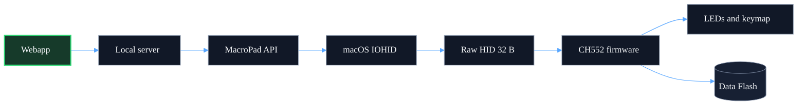
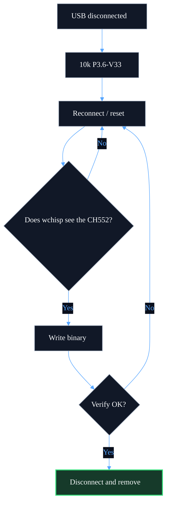
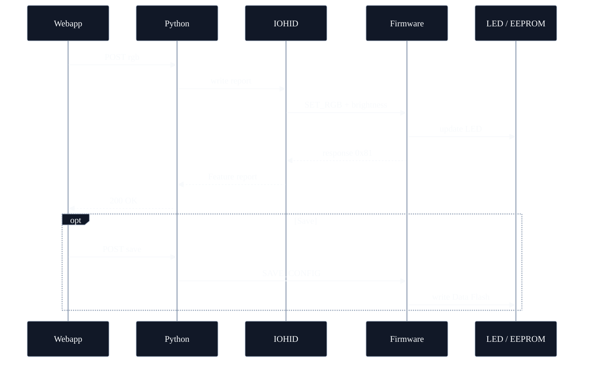
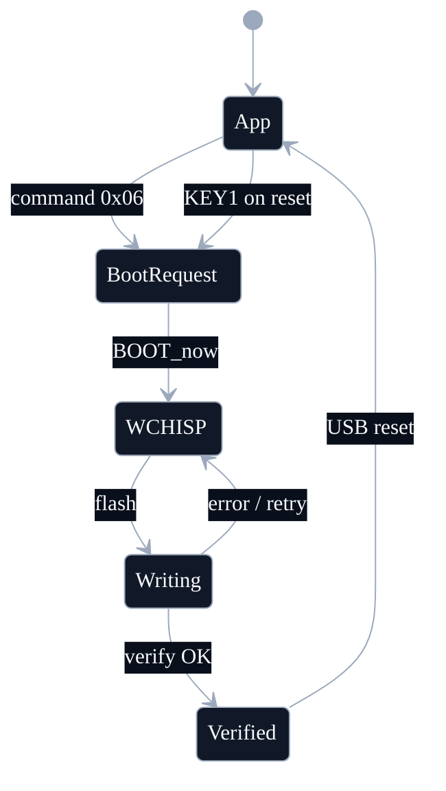

# System diagrams

## Architecture

## First hardware flash

## Lighting command and save

## Application and bootloader states

## Functional connections

The 10 kΩ connection is only used to force the bootloader: pin 12 `P3.6/UDP` to pin 16 `V33`. It is not a series component in the USB path.
