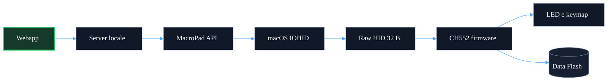
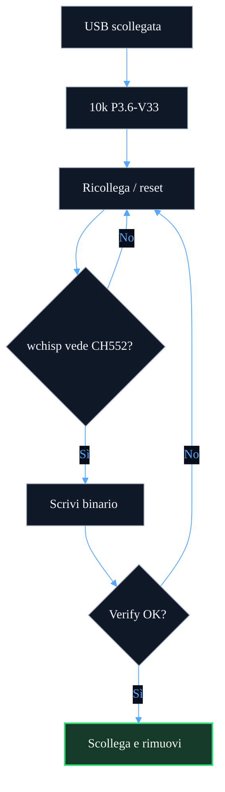
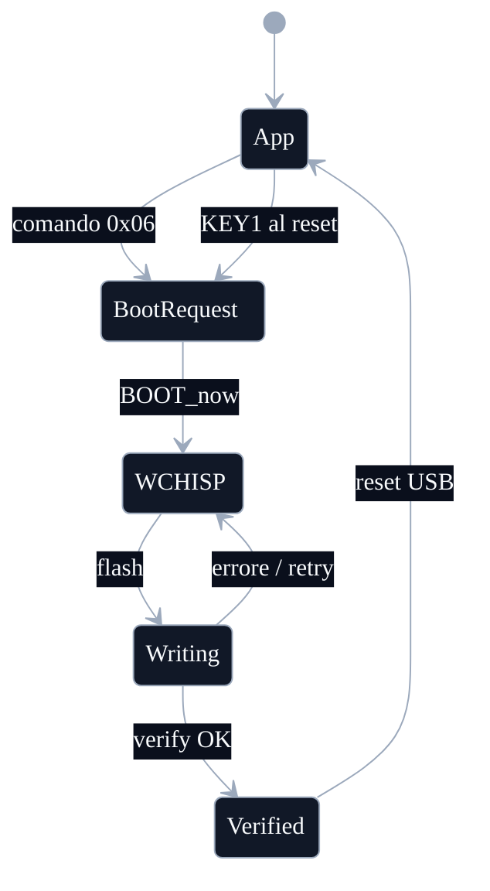
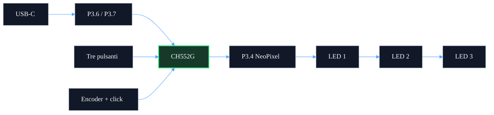

# Schemi del sistema

## Architettura

## Primo flash hardware

## Comando luce e salvataggio

## Stati applicazione e bootloader

## Collegamenti funzionali

Il collegamento da 10 kΩ serve solo per forzare il bootloader: pin 12 `P3.6/UDP` verso pin 16 `V33`. Non è un componente in serie nel percorso USB.

